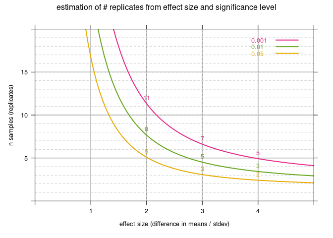

Power analysis with R
================
Michael Jahn
27 januari, 2021

### Introduction

Power analysis is the estimation of the statistical “power” of a
designed experiment. Power means that our experiment is designed in such
a way that the occurence of type I errors (false positives) and type II
errors (false negatives) is minimized. There are four different
parameters that determine the power of the experimental design, whereas
each of those can be calculated by supplying the other three.

  - **sample size** (number of replicates)
  - **effect size** (simplified: the expected difference in means,
    divided by expected standard deviation)
  - **significance level alpha** (probability that the null hypothesis
    was falsely rejected, type I error)
  - **statistical power** (probability that alternative hypothesis was
    correctly rejected, 1 - type II error)

Typically accepted **default values** for some of these parameters are:

  - significance level alpha = 0.05, 0.01
  - power = 0.8 (that means, the probability of a type II error is
    allowed to be 4x or 8x higher than type I error, which is considered
    more “dangerous”)
  - expected effect size is usually the input from the researcher. It is
    estimated from previous experiments (d = (mean1 - mean2)/sd).
  - sample size is usually the desired parameter

Power analysis can be performed for different types of statistical
tests, for example **t-test** (simple comparison of two sample means),
ANOVA (regression analysis for conditions with several different
variables, e.g. different measurement time points). Here, the R package
`pwr` is used.

### Libraries

``` r
library(tidyverse)
library(pwr)
library(lattice)
library(latticeExtra)
library(latticetools)
```

### Power analysis for t-tests

The most common case is probably to estimate the number of replicates
required to detect a significant difference of two sample means, given a
fixed standard deviation. A single power analysis calculation for 2
means of 10 and 20, and common standard deviation sd = 5, looks like
this: (the `type` argument also takes values `one.way` and `paired`)

``` r
pwr.t.test(d = abs(10-20)/5, sig.level = 0.05, power = 0.8, type = "two.sample")
```

    ## 
    ##      Two-sample t test power calculation 
    ## 
    ##               n = 5.089995
    ##               d = 2
    ##       sig.level = 0.05
    ##           power = 0.8
    ##     alternative = two.sided
    ## 
    ## NOTE: n is number in *each* group

A single calculation is not very useful. More useful is to obtain a
table or a graph that summarizes the minimum number of samples
(replicates) for a fixed significance level alpha, `sig.level = 0.05`,
`power = 0.8`, and variable effect sizes. Here, typical effect sizes
could range from 0.05 (`difference of means == sd/20`), to 5
(`difference of means == 5 * sd`). An `effect size == 1` means that sd
and difference in sample means is equal. Higher effect size means sd is
smaller than difference in sample means. We can set up an example table.

``` r
df_power <- tibble(
  power = rep(0.8, 100),
  effect_size = seq(0.05, 5, 0.05)
)

# add power calculation two-sided t-test
df_power <- df_power %>%
    mutate(
      n_samples_t_test_0.05 = sapply(effect_size, function(x) 
        pwr.t.test(d = x, sig.level = 0.05, power = 0.8, type = "two.sample")$n),
      n_samples_t_test_0.01 = sapply(effect_size, function(x) 
        pwr.t.test(d = x, sig.level = 0.01, power = 0.8, type = "two.sample")$n),
      n_samples_t_test_0.001 = sapply(effect_size, function(x) 
        pwr.t.test(d = x, sig.level = 0.001, power = 0.8, type = "two.sample")$n)
  )

# rearrange table to long format (all n values in 1 column)
df_power <- df_power %>% 
  pivot_longer(cols = starts_with("n_samples"), values_to = "n_samples", names_to = "alpha") %>%
  mutate(alpha = as.numeric(str_extract(alpha, "0.[0-9]+")))

head(df_power)
```

    ## # A tibble: 6 x 4
    ##   power effect_size alpha n_samples
    ##   <dbl>       <dbl> <dbl>     <dbl>
    ## 1   0.8        0.05 0.05      6280.
    ## 2   0.8        0.05 0.01      9345.
    ## 3   0.8        0.05 0.001    13662.
    ## 4   0.8        0.1  0.05      1571.
    ## 5   0.8        0.1  0.01      2337.
    ## 6   0.8        0.1  0.001     3418.

-----

We can plot the number of replicates depending of effect size, and
significance level alpha.

``` r
df_power %>%
  xyplot(n_samples ~ effect_size, .,
    groups = alpha,
    par.settings = custom.colorblind(), as.table = TRUE,
    main = "estimation of # replicates from effect size and significance level",
    xlab = "effect size (difference in means / stdev)", ylab = "n samples (replicates)",
    ylim = c(0, 20), xlim = c(0, 5), type = "l", lwd = 2,
    panel = function(x, y, ...) {
      panel.grid(h = -1, v = -1, col = grey(0.6))
      panel.abline(h = 1:19, lwd = 1, lty = 2, col = grey(0.8))
      panel.abline(v = c(1:5), lwd = 1, lty = 2, col = grey(0.8))
      panel.xyplot(x, y, ...)
      panel.text(x = rep(2:4, each = 3), y = 0.7+y[x %in% c(2,3,4)],
        labels = round(y[x %in% c(2,3,4)]), col = c("#E6AB02", "#66A61E", "#E7298A"))
      panel.key(..., corner = c(0.95, 0.95), points = FALSE, lines = TRUE)
    }
  )
```

<!-- -->
